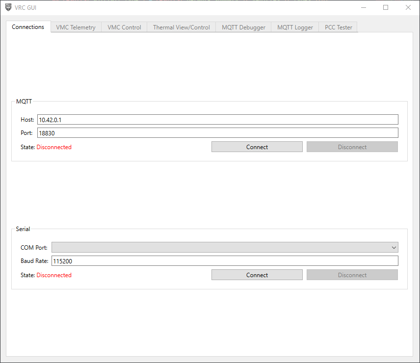
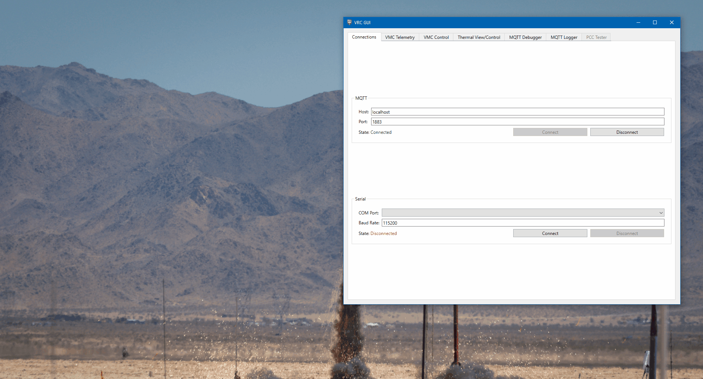
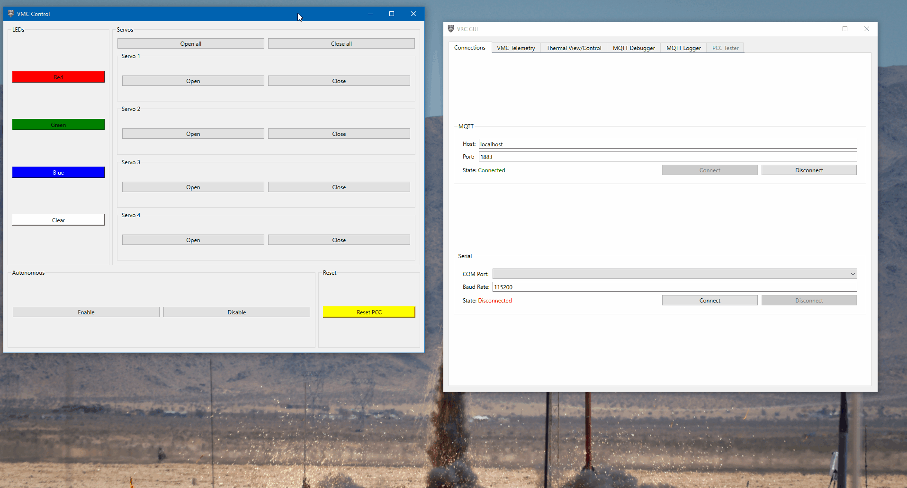
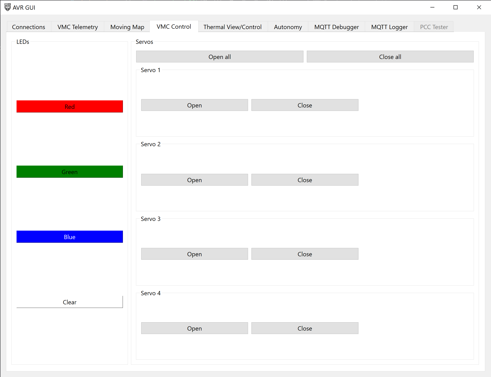
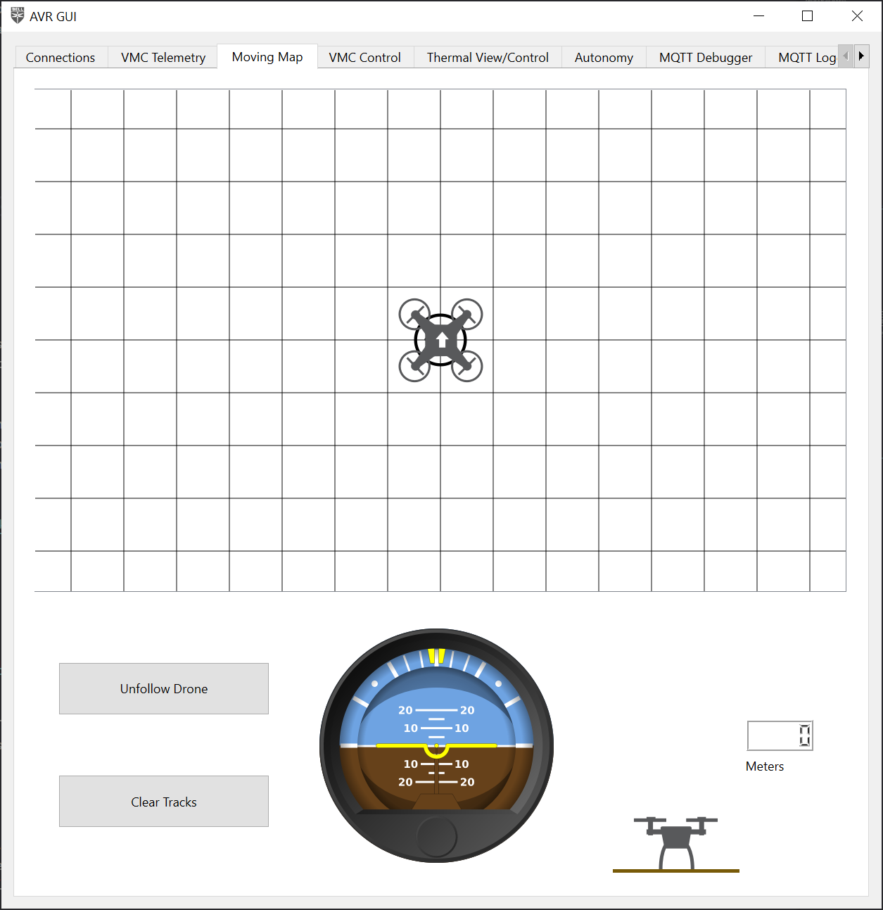
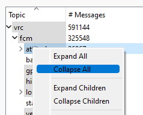
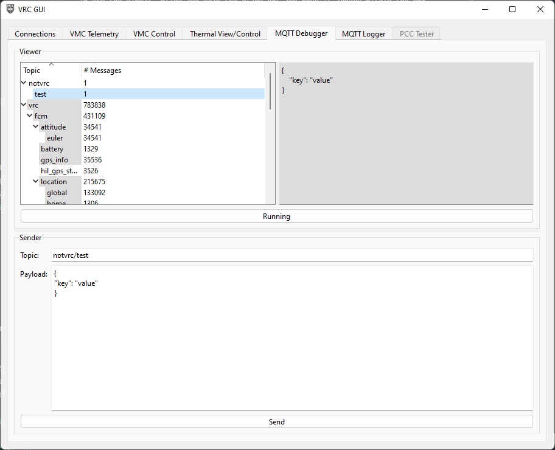
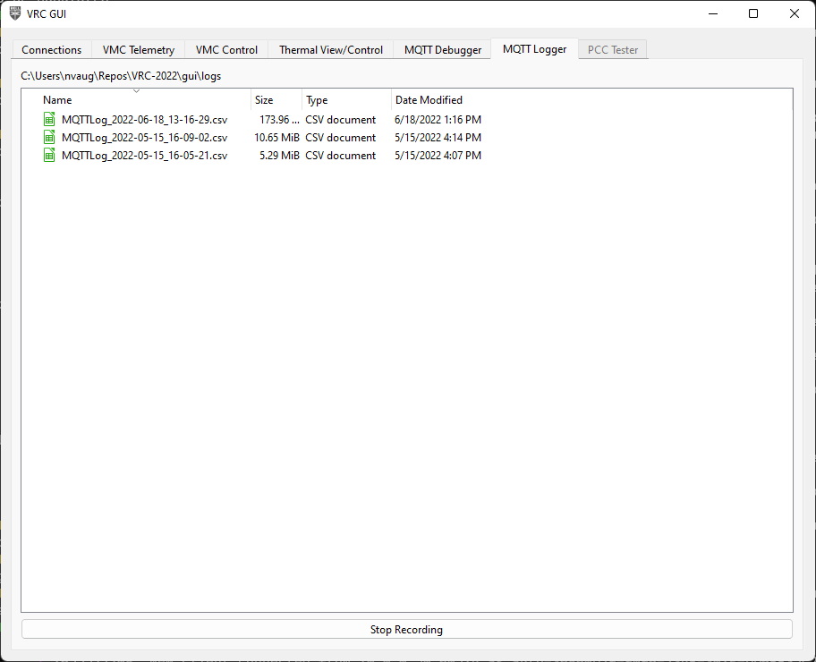

# AVR-GUI

[](https://github.com/psf/black)
[](https://github.com/bellflight/AVR-GUI/actions/workflows/build.yml)

## Development

It's assumed you have a version of Python installed from
[python.org](https://python.org) that is the same or newer as
defined in [`.python-version`](.python-version).

First, install [Poetry](https://python-poetry.org/):

```bash
python -m pip install pipx --upgrade
pipx ensurepath
pipx install poetry
# (Optionally) Add pre-commit plugin
poetry self add poetry-pre-commit-plugin
```

Now, you can clone the repo and install dependencies:

```bash
git clone https://github.com/bellflight/AVR-GUI
cd AVR-GUI
poetry install --sync
poetry run pre-commit install --install-hooks
```

Run

```bash
poetry shell
```

to activate the virtual environment.

To start the GUI, launch the `app.py` file:

```bash
python app.py
```

## Usage

Open the application. You'll be brought to the Connections tab.
After starting the AVR software on your Jetson, put in the Jetson's IP address
under the "MQTT" section. Leave the port as is.



Click "Connect", and make sure the application properly connects.


If the application is unable to connect to your drone, the state will
show as "Failure". Make sure the software is running, and you got
the IP address correct.

After the application connects, all the VMC-related tabs will become enabled.

## Tabs

The functionality of the application is broken up into multiple tabs.
These tabs are automatically enabled/disabled based on the connectivity
currently available. These tabs can be re-ordered as desired. Additionally,
the tabs can be popped out into separate windows to create a multi-pane view,
either by double clicking the tab, or right-clicking and selecting "Pop out".



To reattach a tab, just close the window.



### VMC Telemetry


This tab is a sort of QGroundControl "Lite" that shows the most
important telemetry information from the drone. This is **NOT** a full
replacement for QGroundControl, but quick view of important information while
your drone is flying.

At the top is the status of the flight controller, with information
about the current GPS fix, battery level and voltage, armed status,
and selected flight mode.

In the middle is the current location of the drone in local and
global coordinates, along with the current attitude of the drone in
roll, pitch, yaw.

Finally, at the bottom is a display of the status of the software modules
required for stabilized flight and April Tag detection. These indicators will
turn green once MQTT messages are received from a module, and will turn red if
more than a second has elapsed since the last received message.


If all 4 indicators are green, you are good to fly!

### VMC Control



This tab allows you to control various aspects of the drone, including the
LEDs, and servos connected to the PCC.

Click the individual open/close buttons to open/close individual servos, or
click the open/close all buttons at the top of open/close all of the servos
at once.

Click the color buttons to change the color of the LEDs to one of the
presets (red, green, blue). The "clear" button at the bottom turns off the LEDs.

### Autonomy Control


#### Autonomous Enable

The "Autonomous" buttons in the tab, this is purely optional for the teams that have
chosen to write autonomous code. These buttons send an empty message one of two MQTT
topics `avr/autonomous/enable` or `avr/autonomous/disable`.

For any teams writing their own autonomous code, they can write a listener
for this topic to enable/disable their autonomous code at certain points, rather
than have it run continuously the entire time.

Example implementation:

```python
from bell.avr.mqtt.client import MQTTModule
from bell.avr.mqtt.payloads import AvrAutonomousPayload

class Sandbox(MQTTModule):
    def __init__(self) -> None:
        self.enabled = False
        self.topic_map = {
            "avr/autonomous/enable": self.on_autonomous_message_enable,
            "avr/autonomous/disable": self.on_autonomous_message_disable
        }

    ...

    def on_autonomous_message_enable(self) -> None:
        self.enabled = True

    def on_autonomous_message_disable(self) -> None:
        self.enabled = False

    def autonomous_code(self) -> None:
        while self.enabled:
            do_stuff()
```

#### Building Autonomous Enable Drop

Additionally, the buttons for enabling/disabling autonomous water drops are
provided on this page. These buttons send a message to one of the two MQTT
topics `avr/autonomous/building/enable` or `avr/autonomous/building/disable`
with a payload containing the target building ID:

```json
{
    "building": 0
}
```

These messages can be used to tell the drone what buildings are on fire and
if you want to drop water on it or not. For a full list of which buildings
have water drops please refer to the game manual. The activity of using the
`avr/autonomous/building/enable` or `disable` will be implemented by the students
in the sandbox module. [Hint: the above example can also be used in this scenario]

### Thermal View/Control


This tab shows a view of the thermal camera, and provides a means of
controlling the gimbal and turning the associated laser on and off.

You can either calibrate your thermal cameras range manual by typing in a
min and max value, or you can use the auto calibrate feature to get a
dynamic range.

To use the gimbal, click and drag the black dot and move it around within
the box. The bounds of the box are the gimbal's limit.

### Moving Map



A map of your drones movements has been included for reference while flying.
You can use this to reference your location, roll, pitch, yaw, or altitude.

### MQTT Debugger


This tab is a debugging tool that shows all MQTT messages that are passing
through the AVR software, along with giving you the ability to manually
send messages.

In the top half of the tab is the message viewer. On the left side is a tree
view of all the topics with the levels denoting "/"s in the topic name. When you
click on a topic, on the right side will show the last payload received on that
topic, and will update live.


To show or hide topics, click the arrow on the left of the trip item to
expand or hide the next level, or right-click the topic and select "Expand Children"
or "Collapse Children". To expand or collapse everything, select "Expand All"
or "Collapse All".



At the bottom of the viewer is a "Running"/"Paused" button that will
cause the viewer to update live, or freeze the current view. This is not associated
with the MQTT connection in the Connections tabs. This only stops the viewer from
updating when trying to look at data.


In the bottom half of the tab is the message sender. You can put in the topic
you want to send a message to and the payload of the message. Click the "Send"
button at the bottom to send the message, and you will see it show up above in
the message viewer.



> **Warning**
> Send MQTT messages at your own risk! This is a debugging tool, and incorrectly
> formatted messages, or messages with bogus data may
> cause the flight software to crash, digitally and/or physically.

If you want to copy an existing message, right-click on an item in the
message viewer and select "Preload data". This will prefill the topic and
payload of the message into the message sender.


Alternatively, you can select "Copy Topic" or "Copy Payload" to copy the
topic or payload to your clipboard.

### MQTT Logger



This tab is another debugging tool, that can be used to create a log of MQTT
data that can be analyzed at a later time.

Clicking the "Record" button at the bottom will create a folder called "logs"
next to the `.exe` and create a new log file with the starting timestamp in the
name. The log file is just a `.csv` file with 3 columns:

1. Timestamp that the message was sent
2. Topic of the message
3. Payload of the message (JSON data as a string)

Short example:

<!-- markdownlint-disable MD013 -->
```csv
Timestamp,Topic,Payload
2022-05-15T16:05:21.861220,avr/fcm/location/local,"{""dX"": -2.5455074310302734, ""dY"": -1.5015729665756226, ""dZ"": 2.0492169857025146, ""timestamp"": ""2022-05-15T18:43:51.529153""}"
2022-05-15T16:05:21.865960,avr/fcm/attitude/euler,"{""roll"": 0.3597148656845093, ""pitch"": -1.1968730688095093, ""yaw"": -115.29061126708984, ""timestamp"": ""2022-05-15T18:43:51.533150""}"
2022-05-15T16:05:21.867091,avr/fcm/location/global,"{""lat"": 32.8085261, ""lon"": -97.1563602, ""alt"": -0.1720000058412552, ""hdg"": -6245.665443087664, ""timestamp"": ""2022-05-15T18:43:51.534187""}"
2022-05-15T16:05:21.867533,avr/fcm/velocity,"{""vX"": 0.009999999776482582, ""vY"": 0.0, ""vZ"": -0.009999999776482582, ""timestamp"": ""2022-05-15T18:43:51.535720""}"
2022-05-15T16:05:21.886569,avr/fusion/hil_gps,"{""time_usec"": 1652640231557357, ""fix_type"": 3, ""lat"": 328085260, ""lon"": -971563603, ""alt"": 165206, ""eph"": 20, ""epv"": 5, ""vel"": 0, ""vn"": 0, ""ve"": 0, ""vd"": 0, ""cog"": 24600, ""satellites_visible"": 13, ""heading"": 24638}"
2022-05-15T16:05:21.890844,avr/fcm/location/global,"{""lat"": 32.8085261, ""lon"": -97.1563602, ""alt"": -0.1720000058412552, ""hdg"": -6245.528183606103, ""timestamp"": ""2022-05-15T18:43:51.557302""}"
2022-05-15T16:05:21.891264,avr/fcm/velocity,"{""vX"": 0.009999999776482582, ""vY"": 0.0, ""vZ"": -0.009999999776482582, ""timestamp"": ""2022-05-15T18:43:51.560023""}"
2022-05-15T16:05:21.901353,avr/fcm/location/local,"{""dX"": -2.5456197261810303, ""dY"": -1.5016621351242065, ""dZ"": 2.049142837524414, ""timestamp"": ""2022-05-15T18:43:51.571278""}"
2022-05-15T16:05:21.909915,avr/vio/position/ned,"{""n"": -254.60606976676002, ""e"": -143.7991712686676, ""d"": -370.6543833582757}"
2022-05-15T16:05:21.913765,avr/vio/orientation/eul,"{""psi"": -2.870100228693062, ""theta"": 0.7509557925331154, ""phi"": -1.982899257543946}"
2022-05-15T16:05:21.914391,avr/fusion/position/ned,"{""n"": -254.60606976676002, ""e"": -143.7991712686676, ""d"": -370.6543833582757}"
2022-05-15T16:05:21.914799,avr/vio/heading,"{""degrees"": 246.38824134310744}"
2022-05-15T16:05:21.915277,avr/vio/velocity/ned,"{""n"": 0.006583199572207324, ""e"": -0.020817144593196127, ""d"": 0.02579902535054221}"
2022-05-15T16:05:21.915846,avr/vio/confidence,"{""tracker"": 41}"
```
<!-- markdownlint-enable -->

To stop recording, click the "Stop recording" button. This will stop writing
to the log file.

You can do a lot of things with this data. For example, you can plot how your
drone flew through 3D space using `matplotlib` and `pandas`:

<!-- cSpell:disable -->

```python
import json

import matplotlib.pyplot as plt
import pandas as pd

# load in the CSV file
df = pd.read_csv("MQTTLog_2022-05-10_17-08-27.csv")
# parse the JSON data into the Pandas dataframe
df = df.join(df["Payload"].apply(json.loads).apply(pd.Series))
# filter to only data from the avr/fcm/location/global topic
px4_data = df[df["Topic"] == "avr/fcm/location/global"]

fig = plt.figure()
ax = plt.axes(projection='3d')

ax.plot3D(px4_data["lat"], px4_data["lon"], px4_data["alt"], label="PX4")

ax.set_xlabel("Latitude")
ax.set_xlabel("Longitude")
ax.set_zlabel("Altitude")

plt.legend()
plt.show()
```

<!-- cSpell:enable -->


Another example is plotting the drone's battery remaining over time:

<!-- cSpell:disable -->

```python
import csv
import datetime
import json

import matplotlib.pyplot as plt

filename = "MQTTLog_2022-05-15_16-05-21.csv"

x = []
y = []

with open(filename, "r") as fp:
    # create a DictReader to read the CSV file
    reader = csv.DictReader(fp)
    for row in reader:
        # only get data from the avr/fcm/battery topic
        if row["Topic"] == "avr/fcm/battery":
            # parse the JSON data
            payload = json.loads(row["Message"])

            # convert the timestamp to a Python datetime object
            x.append(datetime.datetime.fromisoformat(row["Timestamp"]))
            y.append(payload["soc"])

fig = plt.figure()

plt.plot(x, y)

plt.xlabel("Time")
plt.ylabel("Battery %")

plt.ylim(0, 105)
plt.grid(True)

plt.show()
```

<!-- cSpell:enable -->


### PCC Tester


Before, you launch the application, plug the PCC into your computer with a MicroUSB
cable. The application will not recognize anything plugged in after it starts.

On the "Connection" tab, in the Serial section, select the COM Port your PCC
enumerates as. Click "Connect" and the "PCC Tester" should now be enabled.
